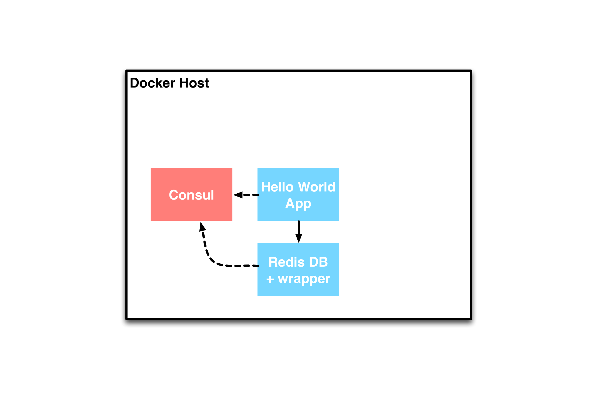

### part2
# Consul
 <!-- .element: class="noborder" -->


!SUB
## Consul introduction

Consul "is a tool for discovering and configuring services in your infrastructure"


[_consul.io_](http://www.consul.io)


!SUB
### Consul Features

 - Service discovery
 - Health checking
 - Key value store
 - Multi-datacenter


[_consul.io_](http://www.consul.io)


!SUB

### Consul works with

 - Peer to peer networking
 - Gossip protocol (Serf)
 - An agent per node
 - A DNS interface (compatibility)
 - A REST interface (rich API)


!SLIDE
### part2a
 <!-- .element: class="noborder" -->

## service discovery using Consul


!SUB
### Consul Service Discovery interfaces

- DNS: Simple, no changes to application needed, legacy-friendly
- HTTP: For richer metadata


<br>We'll be using Consul's DNS interface for this example


!SUB
### Docker with Consul DNS based Service Discovery
Docker can supply [custom DNS configurations](https://docs.docker.com/articles/networking/#configuring-dns) to containers

This allows us to use the DNS Service Discovery interface provided by Consul with all our containers


!SUB
### Docker settings
For Consul's DNS based Service Discovery

- Start Docker daemon with extra parameter: `--dns <IP of docker0>` <small>(this has already been done in the Docker host image we're using)</small>
- Bind Consul as DNS server to the Docker host


!SUB
### Bind Consul as a DNS server to the Docker host
To bind Consul's DNS service to the Docker host we have to do the following with the Consul container

- Publish Consul's DNS port to the Docker host (Docker: `-p 53:53`)
- Publish Consul's HTTP endpoint to the Docker host (Docker: `-p 8500:8500`)


!SUB
### Bind Consul as a DNS server to the Docker host
We also have to tell Consul to bind it's DNS and HTTP interfaces to the Docker host

We do this by adding the `-client 0.0.0.0` argument to Consul

<small>(this has already been done in the [cargonauts/consul-web image](https://registry.hub.docker.com/u/cargonauts/consul-web/) we're using)</small>


!SUB
Example `Vagrantfile`
```
Vagrant.configure("2") do |config|
...
  config.vm.define "consul" do |consul|
    consul.vm.provider "docker" do |d|
      d.image = "cargonauts/consul-web"
      d.ports = ['53:53/udp', '8500:8500']
    end
  end
...
end
```


!SUB
Start the Dockerized Consul, app and database 
```
$ cd part2a
# Start the containers
$ vagrant up --no-parallel
Bringing machine 'consul' up with 'docker' provider...
Bringing machine 'redis' up with 'docker' provider...
Bringing machine 'hellodb' up with 'docker' provider...
==> consul: Docker host is required. One will be created if necessary...
    consul: Docker host VM is already ready.
```


!SUB
Check if the containers are running
```
$ vagrant status
Current machine states:
consul                    running (docker)
redis                     running (docker)
hellodb                   running (docker)

$ docker ps
CONTAINER ID        IMAGE                                 COMMAND                CREATED              STATUS              PORTS                NAMES
adad6ed2d591        cargonauts/helloworld-python:latest   "/srv/helloworld-db.   About a minute ago   Up About a minute   0.0.0.0:80->80/tcp   part1b_hellodb_1425834932
9495f0cbe1f7        redis:latest                          "/entrypoint.sh redi   2 minutes ago        Up 2 minutes        6379/tcp             part1b_redis_1425834915
78f209ea00ba        cargonauts/consul-web:latest          "/consul agent -serv   3 seconds ago        Up 1 seconds        0.0.0.0:53->53/udp, 0.0.0.0:8500->8500/tcp   condescending_payne
```

!SUB
Check if the application works, visit [192.168.10.10](http://192.168.10.10)


!SUB
### Consul WebUI
Consul also has an optional Web Interface

It's available at the same port as Consul's HTTP interface, which we've published to the Docker host at

[192.168.10.10:8500](http://192.168.10.10:8500)


!SUB
Manually add a service to Consul
```
curl -X POST http://consul.service.consul:8500/v1/agent/service/register \
  --header 'Content-Type: application/json' \
  --data-binary '{"ID": "helloworld1", "Name": "helloworld", "Address": "123.4.5.6", "Port": 80}'
```
& check if it's registered
```
docker run -ti cargonauts/toolbox
$ dig helloworld.service.consul +short
123.4.5.6
```

WebUI @ http://DOCKERHOSTIP:8500


!SUB
Remove the manually created service
```
curl -X POST \
	http://consul.service.consul:8500/v1/agent/service/deregister/helloworld1
```


!SUB
Automatically registering a service

Register from within the container after the process has started
```
$ docker run -d redis-with-wrapper
```
Check WebUI for new service


!SUB
Topology including Consul:
 <!-- .element: class="noborder" -->


!SUB
Stopping the container doesn't unregister it
```
$ docker stop CONTAINERID
```
Check webUI, service is still there


!SUB
servicewrapper to register & unregister
```
$ docker stop
# works
$ docker kill
# doesn't
```


!SUB
Can't guarantee cleanup from within a container

So the service registry should be updated from outside the container


!SLIDE
### part2b
 <!-- .element: class="noborder" -->
## Automatic Service Discovery using Consul and Registrator


!SUB
Solution: listen to the Docker event stream

Using Jeff Lindsay's [registrator](https://github.com/gliderlabs/registrator)


!SUB
Automatically register & unregister a container using registrator

!SUB

We've added Registrator to the topology:
 <!-- .element: class="noborder" -->

