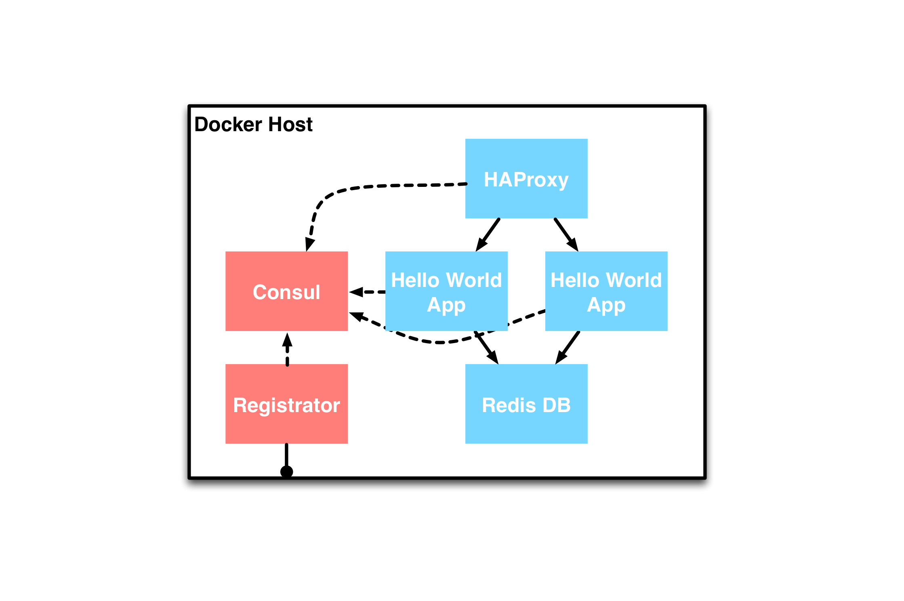

### part3
# Load Balancing
 <!-- .element: class="noborder" -->
 <!-- .element: class="noborder" -->
 <!-- .element: class="noborder" -->


!SUB

## Load-balancing the application

Let's scale out our application


!SUB
Load-balancing could be done with Consul's DNS service

That means standard round-robin DNS

With all its limitations, e.g. caching


!SUB

So we prefer

 <!-- .element: class="noborder" -->

# HAProxy


!SUB

Consul + Registrator gives us service discovery

All necessary information is available: nodes, ports

But we need a way to generate HAProxy configuration


!SUB

## Consul-template

> This project provides a convenient way to populate values from Consul into the filesystem using the consul-template daemon.

See [GitHub](https://github.com/hashicorp/consul-template)


!SUB

Example

```
$ consul-template \
  -consul consul.service.consul:8500 \
  -template "/haproxy.ctmpl:/etc/haproxy/haproxy.cfg:service haproxy restart"
```

<br>

Queries `consul.service.consul:8500`

Renders template `/haproxy.ctmpl` to `/etc/haproxy/haproxy.cfg`

Restarts haproxy service


!SUB

Templates are written in the [Go Template](http://golang.org/pkg/text/template/) format

Exposes additional functions, see [Templating Language](https://github.com/hashicorp/consul-template#templating-language)

<br>

Query all nodes
```
{{nodes}}
```
<br>

Query all services named webapp
```
{{service "webapp"}}
```
<br>

Iterate over all webapp services, accessing several properties
```
{{range service "webapp@datacenter"}}
server {{.Name}} {{.Address}}:{{.Port}}{{end}}
```


!SUB

(Minimal) HAProxy Consul template for our Hello World app
```
global
    daemon
    maxconn 256

defaults
    mode http
    timeout connect 5000ms
    timeout client 50000ms
    timeout server 50000ms

listen http-in
    bind *:80{{range service "hellodb"}}
    server {{.ID}} {{.Address}}:{{.Port}}{{end}}
```

!SUB
We've pre-packaged a HAProxy in the<br>[`cargonauts/consul-haproxy`](https://registry.hub.docker.com/u/cargonauts/consul-haproxy/) image

The source can be found on [GitHub](https://github.com/cargonauts/consul-haproxy)


!SUB
Some small changes to our Hello World App
```
  config.vm.define "hellodb0" do |hellodb0|
    hellodb0.vm.provider "docker" do |d|
      d.image = "cargonauts/helloworld-python"
      d.cmd   = ["/srv/helloworld-db.py"]
      d.env   = {:SERVICE_NAME => 'hellodb'} # assign service name
      d.create_args = ['-P']                 # publish container
                                             # on random port
    end
  end

  config.vm.define "hellodb1" do |hellodb1|
    # We can add a second identical container
  end
```


!SUB
And add our HAProxy container
```
  config.vm.define "haproxy" do |haproxy|
    haproxy.vm.provider "docker" do |d|
      d.image = "cargonauts/consul-haproxy"
      d.cmd   = ["-consul", "consul:8500", "-template", "/haproxy.ctmpl:/etc/haproxy/haproxy.cfg:service haproxy restart"]
      d.ports = ["80:80"]
    end
  end
```


!SUB

The complete topology will look like this:
 <!-- .element: class="noborder" -->


!SUB
### Exercise
Start the Dockerized hello world app using Vagrant
```
$ cd part3
$ v up --no-parallel
Bringing machine 'consul' up with 'docker' provider...
Bringing machine 'registrator' up with 'docker' provider...
Bringing machine 'redis' up with 'docker' provider...
Bringing machine 'hellodb0' up with 'docker' provider...
Bringing machine 'hellodb1' up with 'docker' provider...
Bringing machine 'haproxy' up with 'docker' provider...
```


!SUB
Check if the application works, visit [192.168.190.85](http://192.168.190.85)
Check some fancy HAProxy stats, visit [192.168.190.85/?stats](http://192.168.190.85/?stats)


!SUB
### What just happened?
- `Registrator` registers both `hellodb` containers with consul
- `HAProxy` uses consul-template to monitor `Consul`
- The `HAProxy` config is updated when the data in `Consul` changes


!SUB
### Exercise
Try adding the very first container (from part 1a) to the topology

```
config.vm.define "helloworld" do |helloworld|
  helloworld.vm.provider "docker" do |d|
    d.image = "cargonauts/helloworld-python"
    d.cmd = ["/srv/helloworld.py"]
    d.env   = {:SERVICE_NAME => 'hellodb'} # do not forget to
                                           # assign service name
    d.create_args = ['-P']                 # and publish container
                                           # on random port
  end
end
```

See if HAProxy is updated by<br>visiting [192.168.190.85](http://192.168.190.85) multiple times
